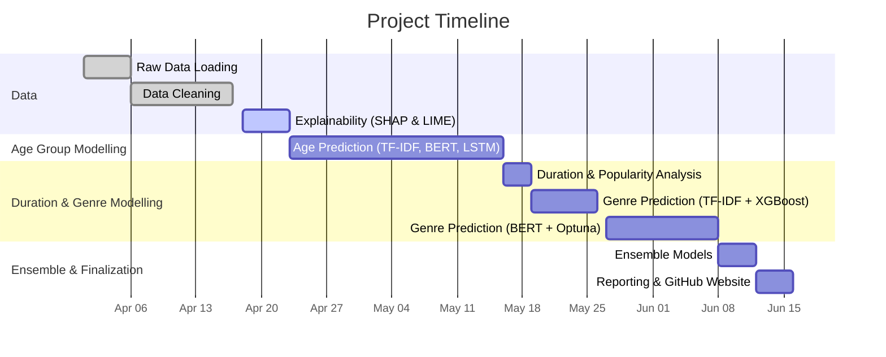

# Gantt Chart

```mermaid
gantt
    title Project Timeline
    dateFormat  YYYY-MM-DD
    axisFormat  %b %d

    section Data
    Raw Data Loading             :done, a1, 2025-04-01, 5d
    Data Cleaning                :done, a2, 2025-04-06, 11d
    Explainability (SHAP & LIME):active, a3, 2025-04-18, 5d

    section Age Group Modelling
    Age Prediction (TF-IDF, BERT, LSTM) : a4, 2025-04-23, 23d

    section Duration & Genre Modelling
    Duration & Popularity Analysis      : a5, 2025-05-16, 3d
    Genre Prediction (TF-IDF + XGBoost) : a6, 2025-05-19, 7d
    Genre Prediction (BERT + Optuna)    : a7, 2025-05-27, 12d

    section Ensemble & Finalization
    Ensemble Models             : a8, 2025-06-08, 4d
    Reporting & GitHub Website : a9, 2025-06-12, 4d
```
